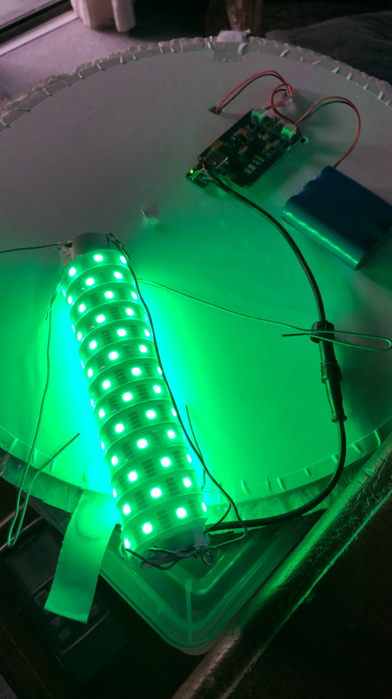
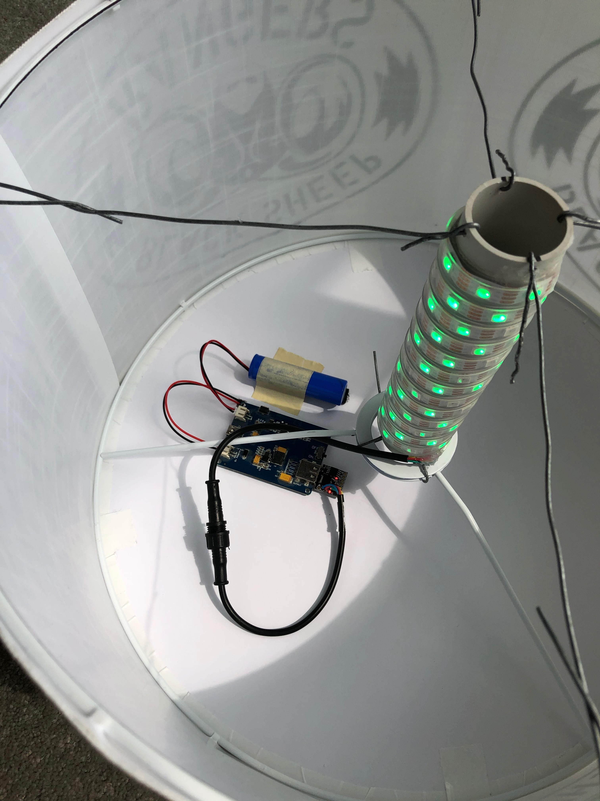

# RangerBeacon_v2
Super simple code for lighting some APA102 LEDs for an illuminated beacon.

Code has two modes, constant and pulsing, and switches between modes upon each boot.  This eliminates the need for a button or switch to set state.

Note:  State is saved via EEPROM, so there is a theoretical limit to the number of power cycles the ATTiny85 can handle before it gets stuck in default mode.

## Arduino library requirements:
- [APA102](https://github.com/pololu/apa102-arduino)
- [EEPROM](https://github.com/Chris--A/EEPROM)

## Design/Construction notes:

Components:
- [DigiSpark ATTiny85 USB form factor microcontroller](https://amzn.to/39q0uu5)
- [Seeed Studio LiPo Rider Pro](https://amzn.to/2Mt9CoV)
- [Adafruit Lithium Ion Battery Pack - 3.7V 6600mAh](https://amzn.to/39waHFL)
- [Strip of APA102 LEDs](https://amzn.to/39pSTMc)
- Lamp shade
- Segment of PVP
- Silicone cement
- Baling wire

Start with a white/translucent lamp shade.  Cut a piece of PVP pipe so that it fits within the height of the lamp shade with a little extra on both ends to drill holes and secure baling wire.  Wrap the pipe in your APA102 LED strip, using silicone cement to secure it in place.

- Program the DigiSpark with this arduino sketch
- Connect the 5v and GND pins of the APA strip to the LiPo Rider Pro directly.  
- DI (Data In) on the APA102 strip goes to D0 on the DigiSpark.
- CI (Clock In) on the APA102 strip goes to D1 on the DigiSpark.
- Plug the DigiSpark into the LiPo Rider.

Put it all together with baling wire, like in the picture below.

The logo silhouette is created by printing your graphics on transparency sheets and affixing to the outside of the lampshade.

Copyright 2020 - Chris Knight - merlin@ghostwheel.com

Released under the [CC BY-NC-SA license](https://creativecommons.org/licenses/by-nc-sa/4.0/)
